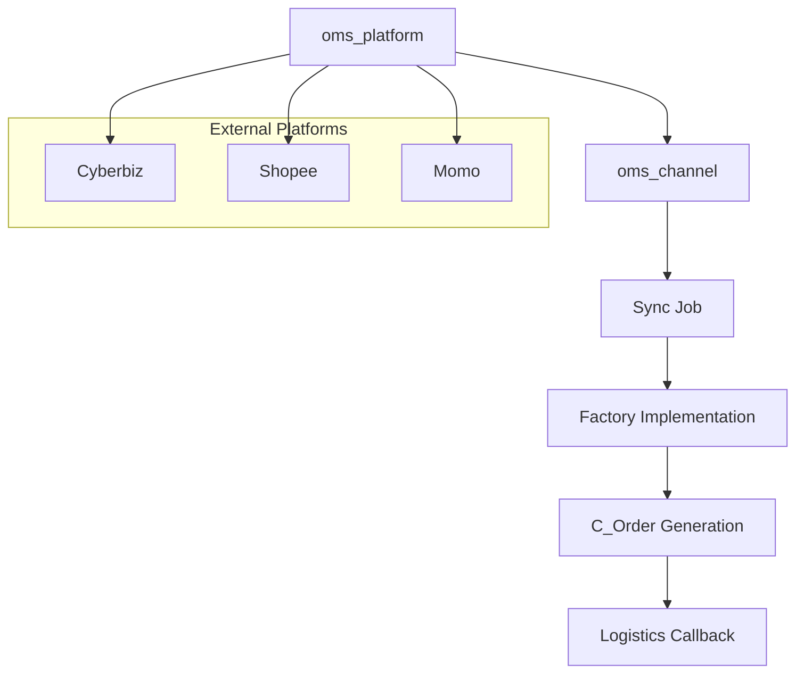

# Architecture

## OrderGetJob = OMSGetOrderProcess.java

The OMS plugin is designed with a layered architecture to separate platform definitions from channel-specific execution.



Components
oms_platform: Platform metadata (API keys, host, name)

oms_channel: Represents one actual online store account

Sync Job: Pulls data from channels periodically or on-demand

Factory: Implements platform-specific APIs

C_Order: The iDempiere standard order document


## RefreshTokenJob = OMSRefreshTokenProcess.java

This job is implemented as `OMSRefreshTokenProcess`, a process registered in the iDempiere Scheduler.  
It accepts `MOMS_Channel_ID` as input and calls the platform-specific refresh logic.

```mermaid
flowchart TD
    A[Scheduler triggers OMSRefreshTokenProcess] --> B[Get MOMS_Channel_ID from parameter]
    B --> C[Load MOMS_Channel from DB]
    C --> D{Which platform?}

    D -->|CyberbizV2| E[Call cbs.refreshToken(channel)]
    D -->|Shopee| F[Call sps.refreshToken(channel)]
    D -->|Others| G[Skip or throw error]

    E --> H[Update access_token in DB]
    F --> H
```
