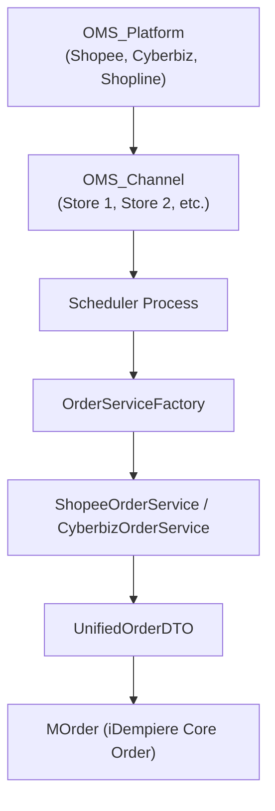
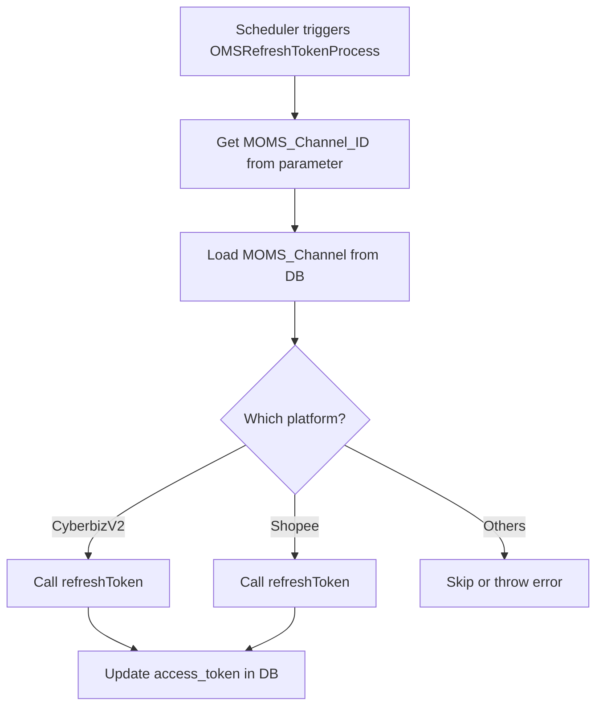

# Architecture

## OrderGetJob = OMSGetOrderProcess.java

The OMS plugin is designed with a layered architecture to separate platform definitions from channel-specific execution.

Components
oms_platform: Platform metadata (API keys, host, name)

oms_channel: Represents one actual online store account

Scheduler: Pulls data from channels periodically or on-demand

Factory: Implements platform-specific APIs

MOrder: The iDempiere standard order document

## RefreshTokenJob = OMSRefreshTokenProcess.java

This job is implemented as `OMSRefreshTokenProcess`, a process registered in the iDempiere Scheduler.  
It accepts `MOMS_Channel_ID` as input and calls the platform-specific refresh logic.

