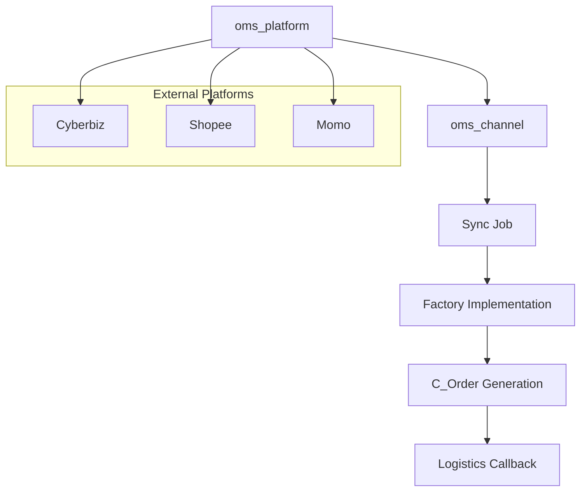

# Architecture

The OMS plugin is designed with a layered architecture to separate platform definitions from channel-specific execution.

Components
oms_platform: Platform metadata (API keys, host, name)

oms_channel: Represents one actual online store account

Sync Job: Pulls data from channels periodically or on-demand

Factory: Implements platform-specific APIs

C_Order: The iDempiere standard order document
