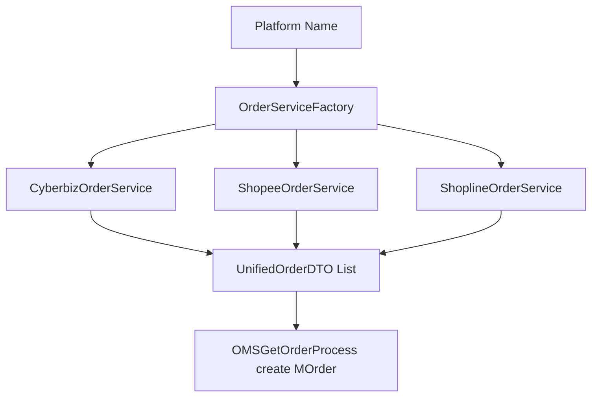
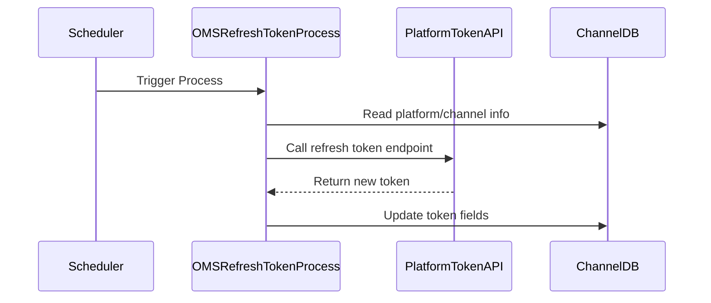

# Developer Guide

## Order Synchronization Architecture (Factory + Service Pattern)

This system adopts a **Factory pattern** combined with multiple concrete **OrderService** implementations.  
It dynamically returns the corresponding service instance based on the platform name input, unified to return a standard order data format `List<UnifiedOrderDTO>`.

### Architecture Overview


### Core Components

OrderService: Unified interface defining fetchOrders(MOMS_Channel channelData), returning a standard list of orders

Concrete platform OrderService implementations: Handle platform API calls and data conversion

OrderServiceFactory: Returns the correct OrderService instance based on platform name

UnifiedOrderDTO: Standard data transfer object representing orders

### Adding a New Platform

1. Implement a new class implementing OrderService, e.g. MyPlatformOrderService, to handle the platform API and convert data

2. Add the new platform name case in OrderServiceFactory to return the new service

3. Callers provide the platform name and get a list of unified orders without concern for platform specifics

## Sample Code
```java!
// OrderService interface
public interface IOrderService {
    List<UnifiedOrderDTO> fetchOrders(MOMS_Channel channelData) throws Exception;
}

// Factory implementation
public class OrderServiceFactory {
    public static IOrderService getService(String platform) {
        switch (platform) {
		case "cyberbizV1":
			return new CyberbizOrderService();
		case "cyberbizV2":
			return new CyberbizV2OrderService();
		case "shopline":
			return new ShoplineOrderService();
            default:
                throw new IllegalArgumentException("Unsupported platform: " + platform);
        }
    }
}

// Shopee service example
public class ShopeeOrderService implements IOrderService {
    @Override
    public List<UnifiedOrderDTO> fetchOrders(MOMS_Channel channelData) {
        List<ShopeeOrder> rawOrders = callShopeeApi(channelData);
        return convertToUnified(rawOrders);
    }
    
    private List<CyberbizOrder> callCyberbizApi(MOMS_Channel channelData) {
        // ...
        return List.of();
    }
    
    private List<UnifiedOrderDTO> convertToUnified(List<CyberbizOrder> rawOrders) {
        // ...
        return List.of();
    }
}

//usage
/*
String platform = "cyberbizV2";
MOMS_Channel channelData = new MOMS_Channel();

OrderService service = OrderServiceFactory.getService(platform);
List<UnifiedOrderDTO> orders = service.fetchOrders(channelData);

*/
```
## RefreshToken process



## Exception Handling

- OrderServiceFactory will throw `UnsupportedOperationException` if the platform is not registered.
- Developers should ensure the `platformName` string is consistent with what's configured in the channel.
- Each OrderService implementation should log platform errors (e.g., API failures) and avoid throwing raw exceptions.

## Extension Tip

- When adding new platforms, prefer small reusable fetch methods (e.g., token handling, pagination)
- Keep platform-specific logic inside their service class only.
